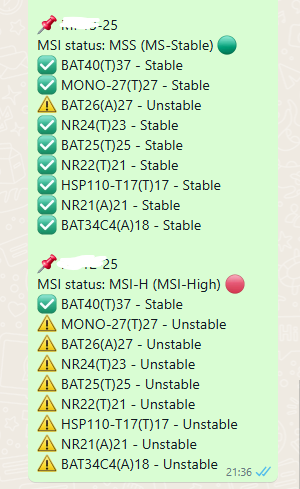

# MSI-multi-pdf-parser

Bu Python betiği, MSI (Mikrosatellit İnstabilite) durum raporlarını içeren PDF dosyalarından özet bilgileri çıkarmak için geliştirilmiştir. 📑

## 📌 Özellikler
- **📂 PDF Seçme:** Birden fazla PDF dosyası seçip işleyebilirsiniz.
- **🔍 MSI Durumu Tespiti:** MSI-H, MSI-L ve MSS durumlarını otomatik algılar.
- **📊 Stabilite Durumu:** Her bir lokusun stabil olup olmadığını belirler.
- **📋 Kopyalama Kolaylığı:** Sonuçları tek tıkla kopyalama.
- **📜 Büyük & Kaydırılabilir Metin Alanı:** Rahat okunabilir tasarım.
- **🔄 İlerleme Çubuğu:** Büyük PDF işlemlerinde ilerleme durumu gösterir.

## 🛠️ Kurulum
Python yüklü değilse, önce yükleyin: [Python İndir](https://www.python.org/downloads/)

### 📦 Bağımlılıklar:
Bu betik **pdfplumber** ve **tkinter** kütüphanelerini kullanır. Terminal veya Komut İstemi'nde şu komutları çalıştırarak yükleyebilirsiniz:

```bash
pip install pdfplumber
```

## 🚀 Kullanım
1. **Betiği çalıştırın:**  
   ```bash
   python msi_parser.py
   ```
2. **📂 "PDF Seç" butonuna tıklayın ve PDF’leri seçin.**  
3. **🔄 İşlem tamamlandığında MSI durumları ekrana gelir.**  
4. **📋 "Kopyala" butonuna basarak sonucu panoya kaydedebilirsiniz.**  

## 📸 Ekran Görüntüsü


## 📜 Lisans
Bu proje **MIT Lisansı** ile lisanslanmıştır. Özgürce kullanabilir ve geliştirebilirsiniz. 🚀
